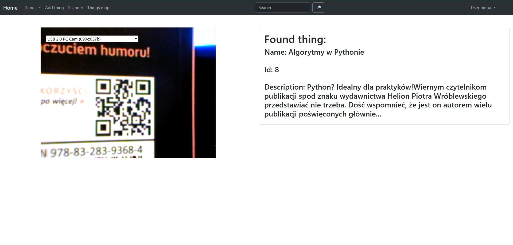
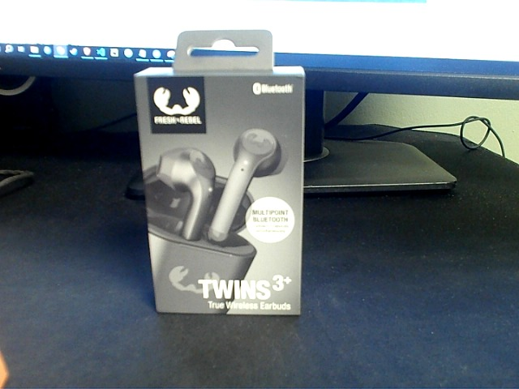
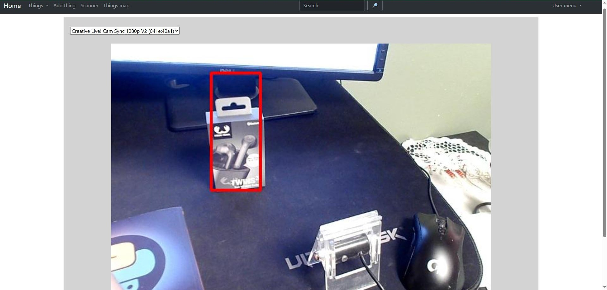
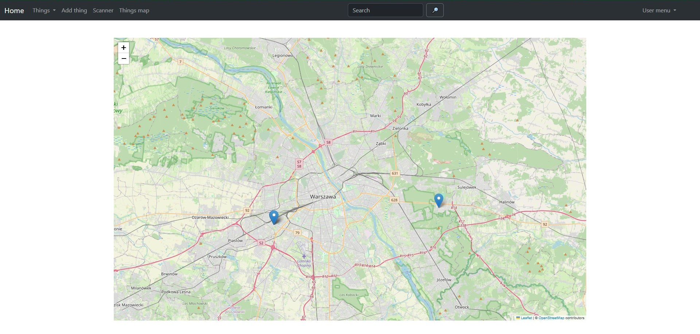

# Where Do I Have It
A Django application for managing items, their locations, and searching using images, QR codes, and barcodes.

Requirements
- Python 3.11
- Django 4.2.11
- Other dependencies are listed in the requirements.txt file.
## Installation
Clone the repository:
```bash
git clone https://github.com/PPysklo/where-do-i-have-it.git
cd where-do-i-have-it
```
Create and activate a virtual environment:
```bash
python -m venv venv
source venv/bin/activate  # On Windows: venv\Scripts\activate
```
Install the required packages:
```bash
pip install -r source/requirements.txt
pip uninstall channels
pip uninstall daphne
python -m pip install -U channels["daphne"]
```
Apply database migrations:
```bash
cd source
python manage.py migrate
```
Start the development server:
```bash
python manage.py runserver
```
## Usage
1. Create superuser.
2. Log in as a superuser.
3. Add new items, locations, and images.
4. Use the QR code or barcode scanner to search for items, or search using a live camera feed of an item image.

## QR scanner:
 

## Object detection:

When a pattern is detected, the program highlights the region:
| Pattern  | 
| ------------- |
|   | 


| Result | 
| ------------- | 
|   | 

## Map 
This function renders a map displaying the locations of all "things" associated with the logged-in user. It utilizes the Folium library to create an interactive map and the Geopy library to convert location names into coordinates.



